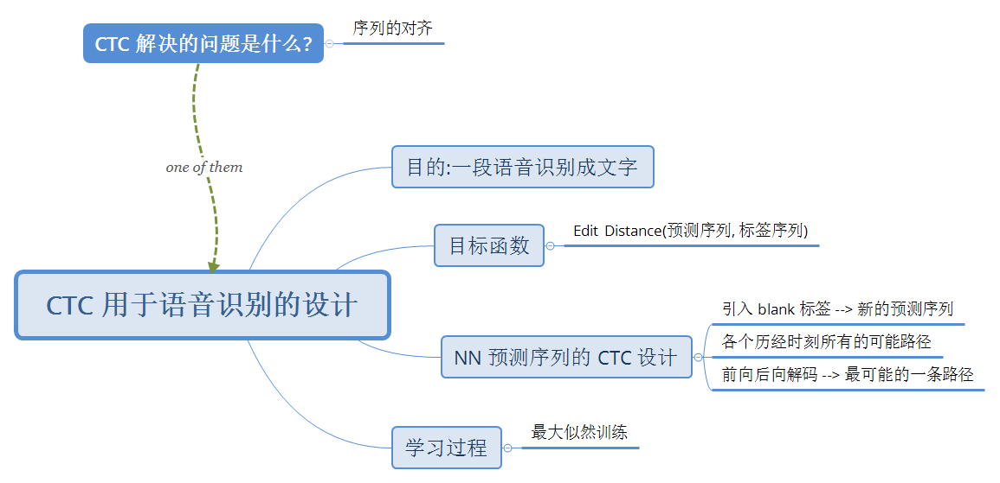
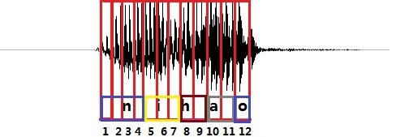
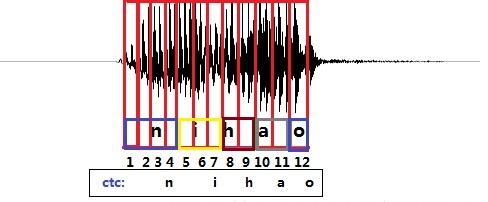
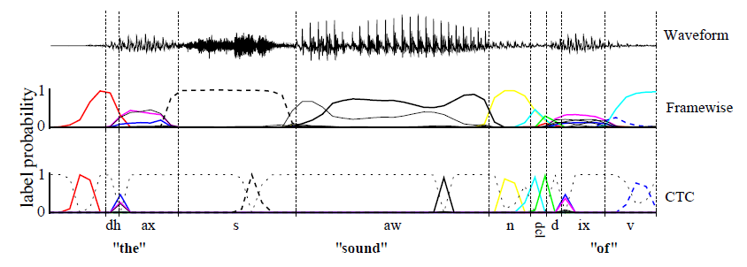
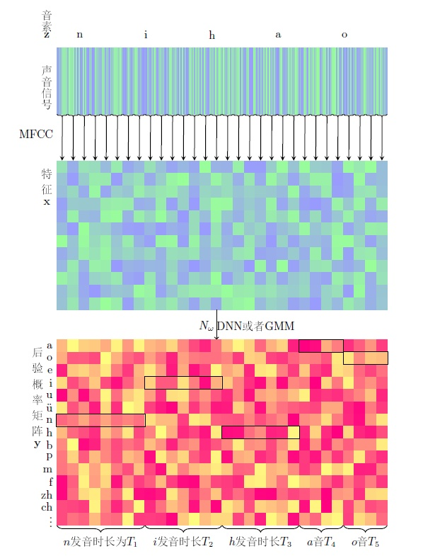
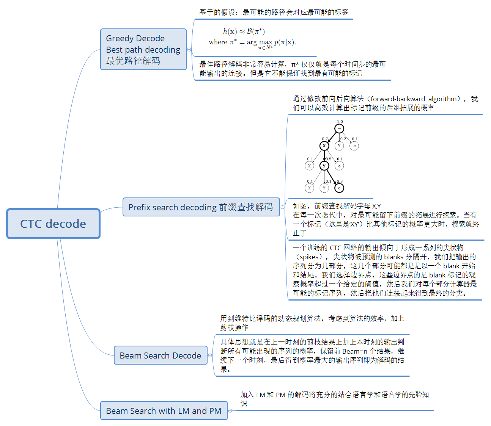
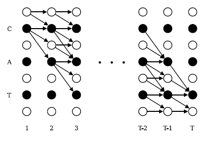
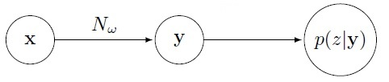

# Connectionist Temporal Classification

## 1 CTC 解决的任务是什么

> “你好” 这句话的声音的波形示意图

图中每个红色的框代表一帧数据，传统的方法需要知道每一帧的数据是对应哪个发音音素。比如

    第 1,2,3,4 帧对应 n 的发音
    第 5,6,7 帧对应 i 的音素
    第 8,9 帧对应 h 的音素
    第 10,11 帧对应 a 的音素
    第 12 帧对应 o 的音素

    (这里暂且将每个字母作为一个发音音素)

假设这个图片中每个红框都作为 RNN 的一步输入，那么（如果这个模型训练的还不错的话）它的输出序列应该是 `nnnniiihhaao`。作为对比，CTC 网络的预测结果如下

CTC 关心预测输出的序列和真实的序列是否接近（相同），不关心预测输出序列中每个结果在相应时间点上是否和输入的序列正好对齐，解决了对输入序列的单个词的切分和对输入序列的整合工作。

传统的语音识别的声学模型训练，对于每一帧的数据，需要知道对应的 label 才能进行有效的训练，在训练数据之前需要做语音对齐的预处理。而语音对齐的过程本身就需要进行反复多次的迭代，来确保对齐更准确，这本身就是一个比较耗时的工作。

而 CTC 关心的是整体上输出是否与标签一致，从而减少了标签预划定的冗杂工作。

能实现这样的功能，在于 CTC 引入了 blank 标签（该帧没有预测值），每个预测的分类对应的一整段语音中的一个 spike（尖峰），其他不是尖峰的位置认为是 blank。对于一段语音，CTC 最后的输出是 spike 的序列，并不关心每一个音素持续了多长时间。

根据上图，直观感受一下 CTC 与 framewise 的不同之处。在 framewise 训练中，每一帧的标签需要预先划分，如垂直虚线所示；在输出标签概率上，CTC 中每个标签的输出概率像是有一个尖峰，代表这个时间段这个标签的概率最高，而标签与标签之间是由空白标签来分隔的，空白标签的概率由灰色虚线表示。

### CTC 语音处理之外的用途

这种神经网络 + CTC 的结构除了可以应用到语音识别的声学模型训练上以外，也可以用到任何一个输入序列到一个输出序列的训练上。

> 比如，OCR 识别也可以采用 RNN+CTC 的模型来做，将包含文字的图片每一列的数据作为一个序列输入给 RNN+CTC 模型，输出是对应的汉字，因为要好多列才组成一个汉字，所以输入的序列的长度远大于输出序列的长度。而且这种实现方式的 OCR 识别，也不需要事先准确的检测到文字的位置，只要这个序列中包含这些文字就好了。

## 2 时序分类器（Temporal Classification）

对于一段语音，假设要翻译成文字，我们的目标是训练一个时序分类器 h 来将输入转换（映射）成我们需要的结果

### label 的错误率计算

评价标签的错误率（label error rate）使用最小编辑距离（Edit Distance, ED）的方法。即，用于 CTC 的损失函数是 `Lebal Error Rate(LER)`

> ED(p,q) ：序列 p 和 q 的编辑距离，即把 p 变为 q 所需要的插入，替换，删除的最少次数

即，使用分类器 h 在测试集 S′ 上测试的标签错误率，计算方法是，对于每个样例，计算分类器的输出与 label 的最小编辑距离，然后除以 label 的长度，再把这些求和除以测试集的长度。

## 3 从网络输出到预测序列：路径 π 和 B 变换

对于其中一个样本表示一个长度为 T 帧的数据，每一帧的数据是一个维度为 m 的向量。可以理解为对于一段语音，每 25ms 作为一帧，其中第 i 帧的数据经过 MFCC 计算后得到的结果。

表示这段样本语音对应的正确的音素。比如，一段发音 “你好” 的声音，经过 MFCC 计算后，得到特征 x ，它的文本信息是 “你好”，对应的音素信息是 z=[n,i,h,a,o]。

特征 x 在经过 RNN 的计算之后，在经过一个 softmax 层，得到音素的后验概率 y 。表示在第 t 帧时刻，发音为音素 k 的概率。

> 其中音素的种类个数一共 n 个，k表示第 k 个音素，在一帧的数据上所有的音素概率加起来为 1。即：

以一段 “你好” 的语音为例，经过 MFCC 特征提取后产生了 30 帧，每帧含有 12 个特征，矩阵里的每一列之和为 1。后面的基于 CTC-loss 的训练就是基于后验概率 y 计算得到的。

CTC 网络的 softmax 输出层输出的类别有 |L|+1 种，因为有一个分隔符，比如说是空格。

> 这个分隔符可以很好地区分一个输出序列串中，哪些子串是属于同一个音素的输出结果

假设每一时刻输出的标签概率互不影响，那么整体输出的概率就等于各时刻输出概率的乘积。即，某条路径的概率为

>  是一个输入到输出的定义，这里可以看做是 RNN

从网络的输出映射为一个唯一的 label 的方法，其实就是把输出串的 blank 删掉，并且相邻的相同字符合并起来。这里定义 B 变换，表示简单的压缩。如

则在输入为 x 的时候，输出一个给定 label 的值  的概率

> 其中是输出序列规整函数的反函数。如

### 3.1 解码方式

最终我们要的结果就是概率最大的那个 label 序列

要枚举所有的可能  的的话，路径数量成指数增长，所以需要一个有效的计算方式。

### 3.2 CTC 的前向后向算法

把给定的  做了一些修改，把每个字符之间还有前后两端插入了一个 blank，得到了 ′，它的长度是 2||+1。这样，我们就允许字母与 blank 之间的概率转移以及不同的字母之间的概率转移。

> 黑圈代表 blank，白圈代表字母标签，箭头表示正确路径时概率转移的方向

这个问题可以用动态规划算法（dynamic programming algorithm）解决，类似于 [HMM 中的向前向后算法](http://freemind.pluskid.org/machine-learning/hmm-forward-backward-algorithm/)，核心思想是所有路径可以分解为根据给定标签的前缀来计算：对一个标记的所有路径求和，可以被分解为一个迭代路径的求和。路径对应标记的前缀，这个迭代过程可以用递归的前向和后向变量高效的计算。

这个方法是基于这样一个结论：t 时刻的一个前缀 s，可以通过 t-1 时刻算出的前缀的结果推导出来。

定义前向变量

定义了对于特定的的前缀来说，就是在 t 时刻可以转化成这个前缀的路径的概率总和。

初始值

2" title="\alpha _{1}(1)=y_{b}^{1}\\ \alpha _{1}(2)=y_{l_{1}}^{1}\\ \alpha _{1}(s)=0,\forall s>2" />

状态转移方程

然后，我们可以用相似的方法定义后缀的概率，这里的 s 指的就是从第 s 个字符到最后。

初始值

状态转移方程

## 4 最大似然训练

ctc 训练流程和传统的神经网络类似，构建 loss function，然后根据 BP 算法进行训练。

CTC 的训练过程是通过调整 w 的值，过程如下

因此，只要得到，即可根据反向传播，得到 。

(1) 定义目标函数

对于一个特定的时刻 t 和位置 s 来说

我们想要计算 p(l|x)，可以把这些情况全都加起来

(2)BP

损失函数对  偏导数

### appendix

符号|解释
---|---
|训练集
|测试集
|一个训练样例中的输入的序列
|对应的 label 的输出序列
|输出序列长度要小于等于输入序列的长度
|时序分类器
|字符集
|输出空间，是字符集中的字符的组合序列
|网络的所有输出元素的集合
|一个长度为 T的输出序列
|表示一条由 L 中元素组成的长度为 T 的路径，其中 π 是指所有满足目标标签的可能路径
|前向
|后向

### reference

- [Connectionist Temporal Classification: Labelling Unsegmented Sequence Data with Recurrent Neural Networks](Connectionist-Temporal-Classification.pdf)
- [A visual guide to CTC](https://distill.pub/2017/ctc/)
