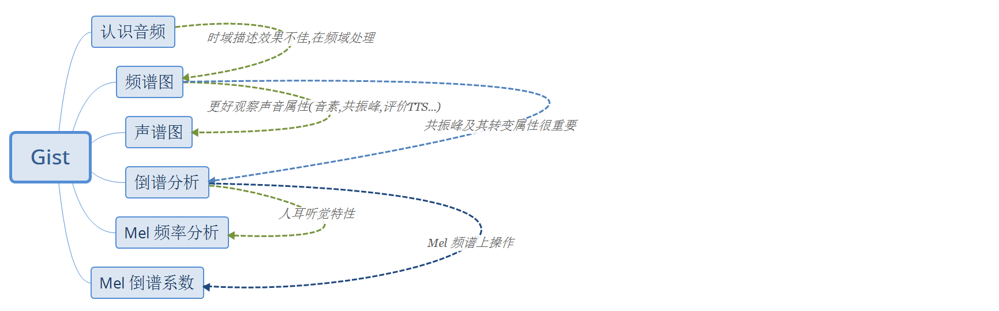
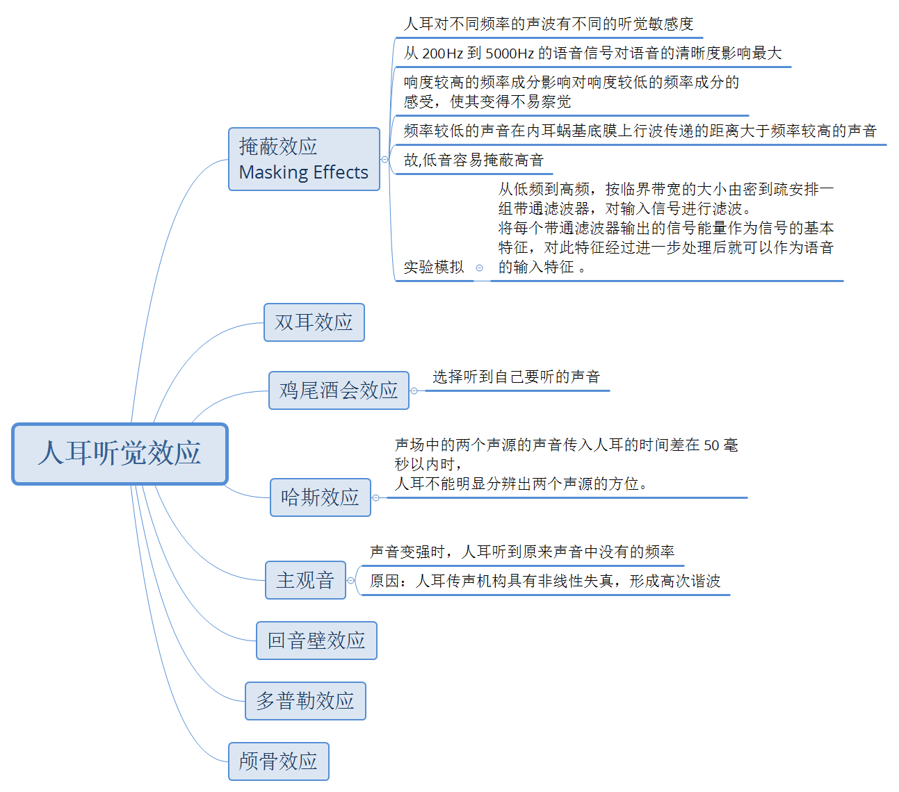
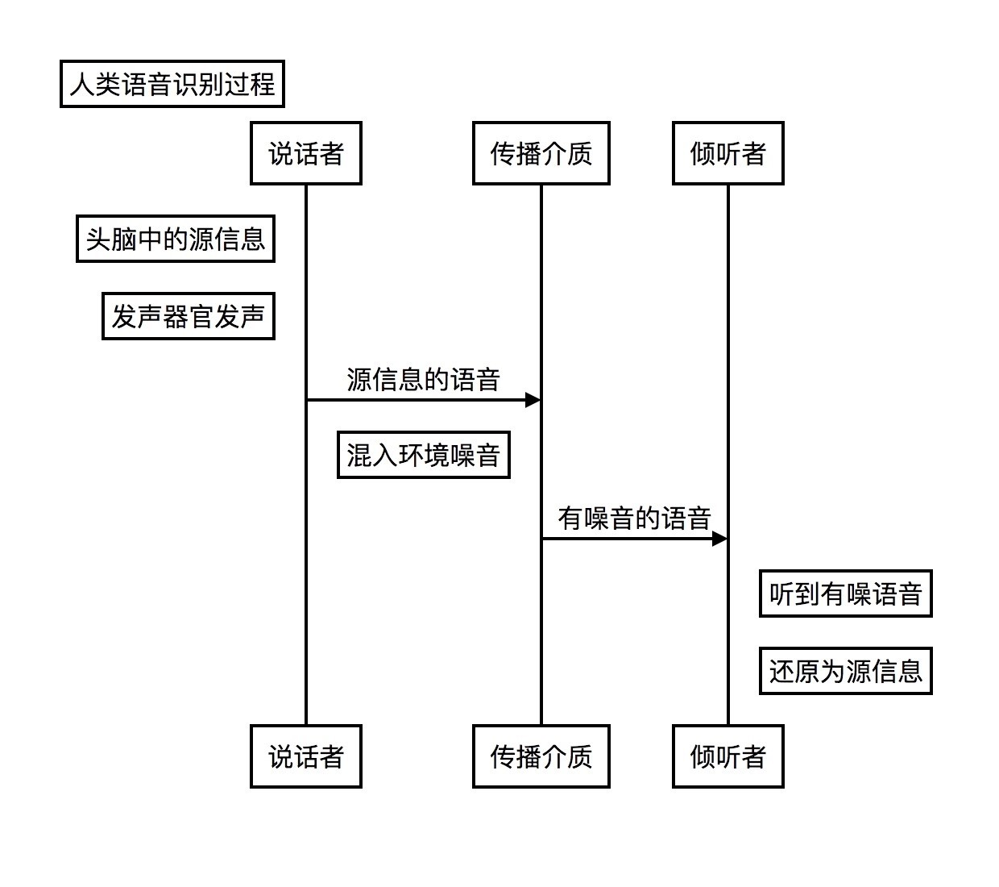
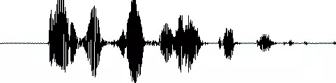
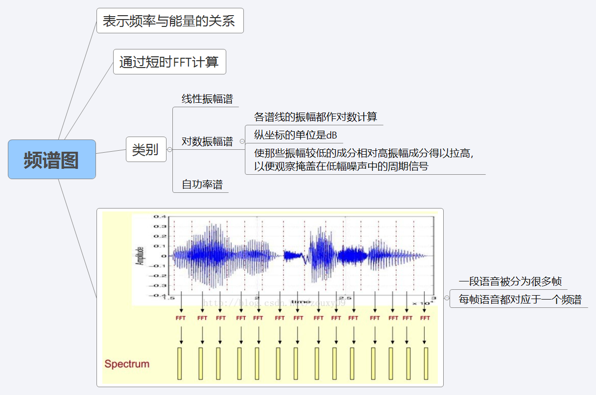
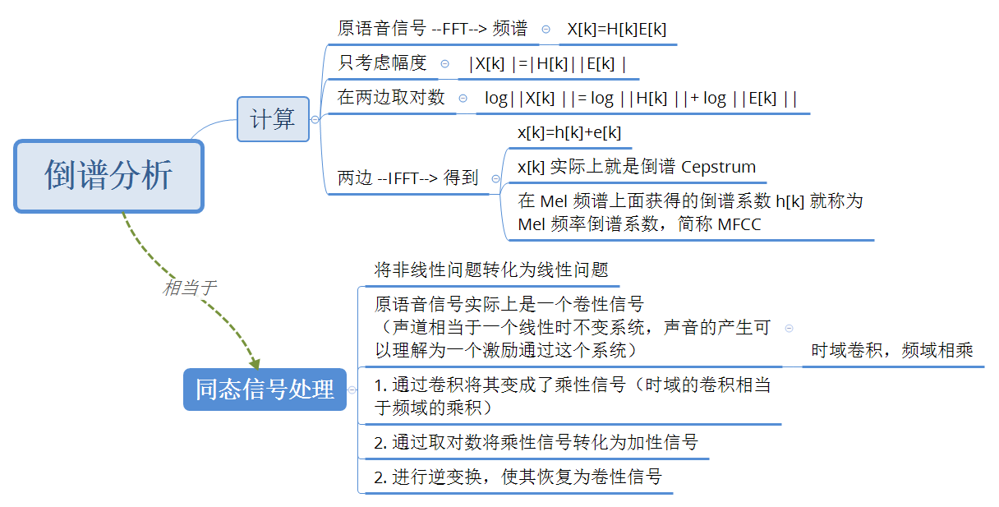
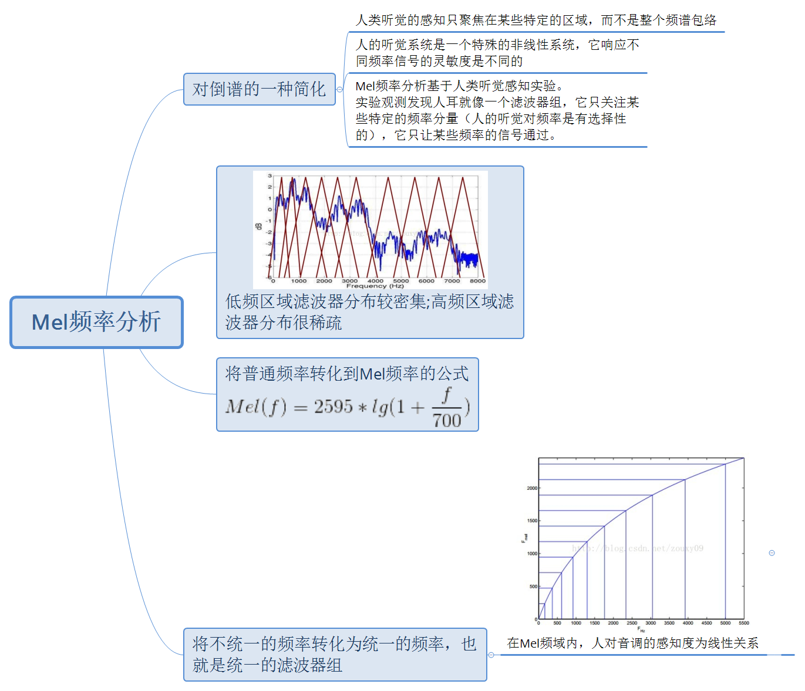
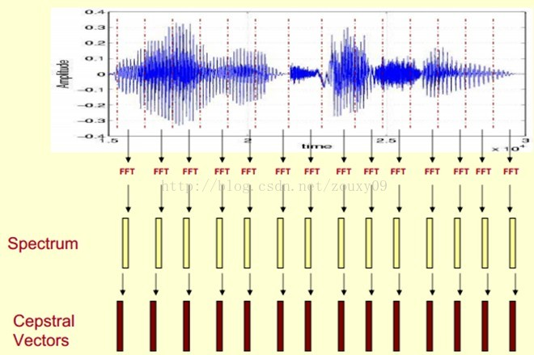
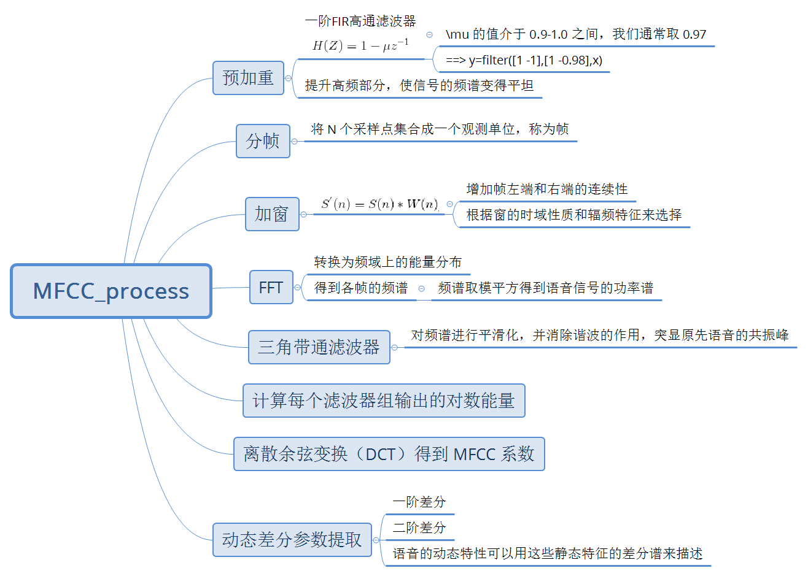
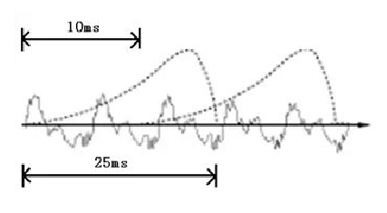

# Speech recognition based on HMM



---

1. ## 人耳听觉机理

    

    

1. ## 认识音频

    - ### [音频文件介绍](音频文件介绍.md)

        

        进行语音识别等处理时,首先对音频进行**静音切除 VAD**

1. ## 从频谱到声谱

    + ### 频谱图(spectrum)

        

    + ### 频谱图 ==> 声谱图(spectrogram)

        > 转换目的：增加时间维度，这样就可以显示一段语音而不是一帧语音的频谱
        >
        > 而且可以直观地看到静态和动态的信息

        

        * 将一帧语音的频谱坐标表示，后旋转90度

        * 把幅度映射到一个灰度级表示（将连续的幅度采样、量化）

            > 0表示黑，255表示白色。幅度值越大，相应的区域越黑

        * 即得随时间变化的频谱图 ==> 描述语音信号的声谱图

        下图是一段语音的声谱图，很黑的地方就是频谱图中的峰值（**共振峰 formants**）

        

1. ## 倒谱分析（Cepstrum Analysis）

    

    峰值表示语音的主要频率成分，我们把这些峰值称为**共振峰**，而共振峰就是携带了声音的辨识属性，用它就可以识别不同的声音。

    + ### 提取共振峰 ==> 提取包络

        提取的不仅仅是共振峰的位置，还得提取它们转变的过程。所以我们提取的是频谱的**包络（Spectral Envelope）**。

        包络就是一条连接这些共振峰点的平滑曲线。

        

        * **原始的频谱 = 包络 + 频谱细节**

            > 用到的是对数频谱，单位是 dB

            

        * 从 原始频谱信号 中分离出 包络

            

            > 在频谱上做傅里叶变换就相当于逆傅里叶变换 Inverse FFT (IFFT)
            >
            > 在对数频谱上面做 IFFT 就相当于在一个伪频率（pseudo-frequency）坐标轴上面描述信号

            上图也显示

                包络主要是低频成分
                频谱的细节部分主要是高频

        * 包络+频谱细节 还原 原始频谱信号

            

        * 倒谱分析总结

            

            > 这时候，虽然前后均是时域序列，但它们所处的离散时域显然不同，所以后者称为倒谱频域。

            
            > 倒谱（cepstrum）就是一种信号的傅里叶变换经对数运算后再进行傅里叶反变换得到的谱

1. ## Mel 频率分析（Mel-Frequency Analysis）

    

    > 举例来说，如果两段语音的Mel频率相差两倍，则人耳听起来两者的音调也相差两倍。

1. ## Mel频率倒谱系数（Mel-Frequency Cepstral Coefficients）

    MFCC 考虑到了人类的听觉特征，先将线性频谱映射到基于听觉感知的Mel非线性频谱中，然后转换到倒谱上。

    我们将频谱通过一组Mel滤波器就得到Mel频谱。

    公式表述就是

        log X[k] = log (Mel-Spectrum)

    这时候我们在log X[k]上进行倒谱分析

    + 取对数：log X[k] = log H[k] + log E[k]
    + 进行逆变换：x[k] = h[k] + e[k]

    在Mel频谱上面获得的倒谱系数h[k]就称为Mel频率倒谱系数，简称MFCC。

    

1. ## 总结以上过程 --> MFCC 声学特征提取

    

    > MFCC在1980年由Davis和Mermelstein提出。从那时起，在语音识别领域，MFCCs在人工特征方面可谓是鹤立鸡群，一枝独秀。

    + ### MFCC特征的过程

        1. 先对语音进行预加重、分帧和加窗；
        1. 对每一个短时分析窗，通过FFT得到对应的频谱；
        1. 将上面的频谱通过Mel滤波器组得到Mel频谱；
        1. 在Mel频谱上面进行倒谱分析（取对数，做逆变换，实际逆变换一般是通过DCT离散余弦变换来实现，取DCT后的第2个到第13个系数作为MFCC系数），获得Mel频率倒谱系数MFCC

        

        这时候，语音就可以通过一系列的倒谱向量来描述了，每个向量就是每帧的MFCC特征向量。

        

        这样就可以通过这些倒谱向量对语音分类器进行训练和识别了。

        - 再次重复下提取过程

            

### 进一步计划

[基音周期等特征工程](基音周期估计.md)

[voicebox 处理音频实践](https://blog.csdn.net/u014646950/article/details/55050696)

[传统世界模型 HMM-GMM](GMM_HMM.md)

### remark

简记 MFCC 过程

- 预加重

    将语音信号通过一个一阶 FIR 高通滤波器

    

    >  的值介于 0.9-1.0 之间，我们通常取 0.97

    ```matlab
    y=filter([1 -1],[1 -0.98],x)
    ```

    预加重的目的是提升高频部分，使信号的频谱变得平坦，保持在低频到高频的整个频带中，能用同样的信噪比求频谱。同时，也是为了消除发生过程中声带和嘴唇的效应，来补偿语音信号受到发音系统所抑制的高频部分，也为了突出高频的共振峰。

- 分帧

    将 N 个采样点集合成一个观测单位，称为帧。通常情况下 N 的值为 256 或 512，涵盖的时间约为 20~30ms.

    分帧使用移动窗函数来实现。为了避免相邻两帧的变化过大，因此会让两相邻帧之间有一段重叠区域，此重叠区域包含了 M 个取样点，通常 M 的值约为 N 的 1/2 或 1/3.

    通常语音识别所采用语音信号的采样频率为 8KHz 或 16KHz，以 8KHz 来说，若帧长度为 256 个采样点，则对应的时间长度是 (256/8000)*1000=32ms

    
    > 图中，每帧的长度为 25 毫秒，每两帧之间有 25-10=15 毫秒的交叠。我们称为以帧长 25ms、帧移 10ms 分帧。我们称为以**帧长** 25ms、**帧移** 10ms 分帧。

- 加窗 (eg:Hamming Window)

    语音信号是一种随时间而变化的信号，主要分为浊音和清音两大类。浊音的基因周期、清浊音信号幅度和声道参数等都随时间而缓慢变化。可以近似认为在一小段时间里语音信号近似不变，即语音信号具有短时平稳性。

    就可以把语音信号分成一些短段来进行处理。一般每秒的帧数是33~100帧。一般帧之间都有重叠，大多数是50%。帧长一般是10ms到30ms.

    将每一帧乘以汉明窗，以增加帧左端和右端的连续性。

    假设分帧后的信号为 S(n), n=0,1,…,N-1, N 为帧的大小，那么乘上汉明窗后 ,W(n) 形式如下

    

    > 不同的 a 值会产生不同的汉明窗，一般情况下 a 取 0.46

    窗函数一般选择汉明窗或者汉宁窗。具体的可以根据三个窗的时域性质和辐频特征来看。

- 快速傅里叶变换 FFT

    由于信号在时域上的变换通常很难看出信号的特性，所以通常将它转换为频域上的能量分布来观察。所以在乘上汉明窗后，每帧还必须再经过快速傅里叶变换以得到在频谱上的能量分布。

    对分帧加窗后的各帧信号进行快速傅里叶变换得到各帧的频谱。并对语音信号的频谱取模平方得到语音信号的**功率谱**。

    设语音信号的 DFT 为

    

    > 式中 x(n) 为输入的语音信号，N 表示傅里叶变换的点数

- 三角带通滤波器

    对频谱进行平滑化，并消除谐波的作用，突显原先语音的共振峰。此外，还可以降低运算量。

- 计算每个滤波器组输出的对数能量

- 经离散余弦变换（DCT）得到 MFCC 系数

- 对数能量

- 动态差分参数提取（包括一阶差分、二阶差分）

    标准的倒谱参数 MFCC 只反映了语音参数的静态特性，语音的动态特性可以用这些静态特征的差分谱来描述。
    实验证明：把动、静态特征结合起来才能有效提高系统的识别性能。


### Thinks

+ [CSDN_wbglearn](http://blog.csdn.net/wbgxx333/article/details/10020449)

+ [CSDN_JameJuZhang](http://blog.csdn.net/jojozhangju/article/details/18678861)
