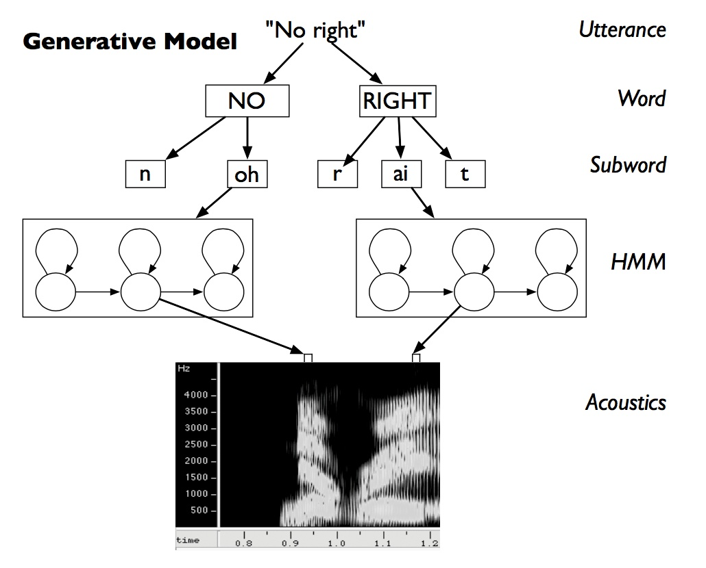
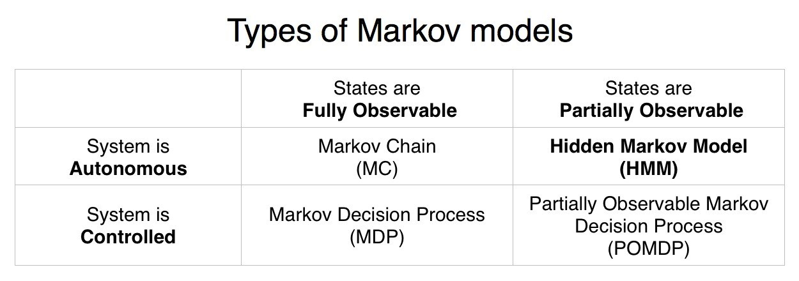
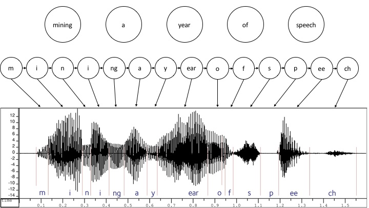
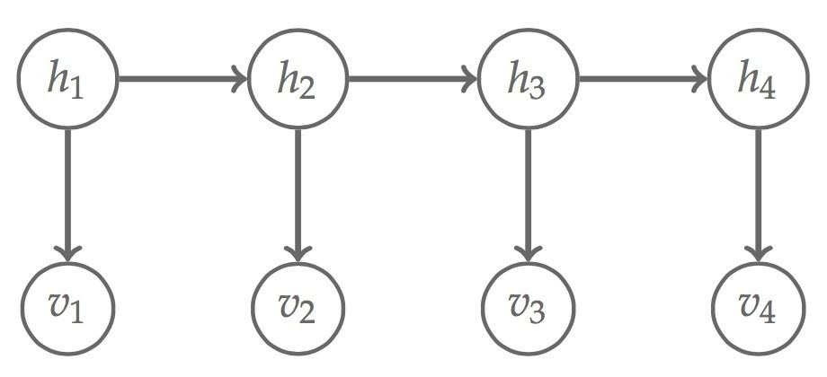
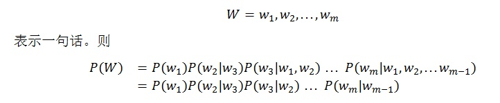
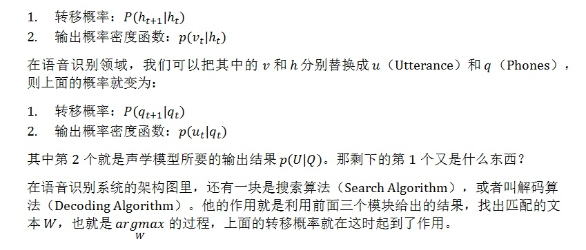
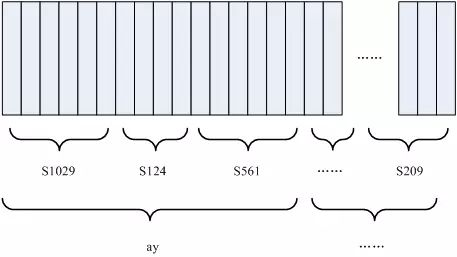
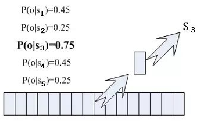
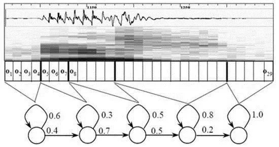

- ## 系统组成

    

    + ### 核心系统：词典 Lexicon

        * 音素：单词的发音由音素构成。

                英语一种常用的音素集是卡内基梅隆大学的一套由 39 个音素构成的音素集，参见 The CMU Pronouncing Dictionary

                汉语一般直接用全部声母和韵母作为音素集，另外汉语识别还分有调无调。

        * 状态：理解成比音素更细致的语音单位。通常把一个音素划分成 3 个状态。

        在只有声学模型和语言模型的系统中，语音 U 和文字 W 是直接关联起来的。但当我们深入去看它们之间的映射关系时会发现，其实它们中间需要做更细的划分。

        
        > 文本需要先切分为单词，之后再切分为语音音素（Phones)，才可以映射到语音。以英文为例，一个单词发音可以切分为标准国际音标，这样音标就成为了比单词更加细致的处理单元。

        单词和音素组合并不是唯一对应的，这样我们就可以建立一个映射表，把每个单词的常见音素组合列出来，这个部分就是词典。

        你可能会问，上面不是说语音规则很难穷举吗，这边的映射表怎么就穷举了呢？其实大规模词汇系统（英文）的实际情况是，当细致到单词层面的时候，每个单词平均有 1.1 个可能发音，也就是说大多数单词的发音是唯一确定的。

        在系统中加入词典之后，原来的核心公式就需要做一点微调了。假设音素用 Q 表示，则公式可以改写为：

        

        此时

            声学模型（Acoustic Model），P(U|Q)：计算任意音素 Q 与语音数据 U 匹配的概率。

            发音模型（PronunciationModel），P(Q|W)：计算文本（单词）W 与音素 Q 匹配的概率。上文提到用词典的方式实现这一部分，实际上也可以使用更复杂的模型。

            语言模型（Language Model），P(W)：计算文本（单词）W 语义上合理的概率。

    + ### 核心系统：声学模型

        语音数据时序性的特征，要求我们在建模的时候不能把每一帧数据独立考虑，而必须体现他们的前后关系。在处理这样的时序数据时，状态机模型（State Machines Model）是一种很好的抽象。状态机模型是对一系列状态（States）和状态关系的建模。

        状态机模型可以根据状态转移是否随机分为确定性模型（Deterministic Models）和随机模型（Stochastic Models），随机模型通常又可以被称为马尔可夫模型（Markov Models）。

        

        

        * #### 为何选择 HMM？

            在声学模型中，我们需要考虑两类状态：

                * 语音音素状态：未知
                * 语音特征状态：已知

            

            上图以 “mining a year of speech” 为例，最上面一层是单词，中间一层是切分出来的音素，下面一层是实际输入的语音数据，声学模型处理第二层和第三层的状态映射。

            图中这样做状态连接的原因在于：

                语音音素状态由于单词构成和语义内涵，彼此之间会具有状态关联性。

                语音特征状态是有隐含的语音音素产生的，因此它们之间具有状态关联性。而语音特征本身并没有语义上的关联性。

            这样的建模出来的结果其实就是隐马尔可夫模型（HMM，Hidden Markov Model）

            

            

    + ### 核心系统：语言模型

        通过语言模型，我们可以从中筛选出那些有含义的句子。

        语言模型中最常用的是 n-grams 模型，其中 n 代表我们要关联前面几个词。以最简单的 Bigram 模型（即 n=2) 为例，我们用

        

        其中的转移概率通常是通过解码算法（Decoding Algorithms）来计算的，例如 Viterbi Algorithm。而输出概率有多种计算方法，这些不同的计算方法就是不同的声学模型。（眼熟？把 h 换成 W，v 换成 U，输出概率就是声学模型所要计算的东西）。

        * #### 搜索／解码算法

            HMM 的概率图模型，包含了两类概率

            

            在 HMM 框架下，一般会使用 Viterbi 解码算法。

        + ### 语音识别是怎么工作的呢？

            

            1. 把帧识别成状态（难点）
            1. 把状态组合成音素
            1. 把音素组合成单词

            
            > 图中，每个小竖条代表一帧，若干帧语音对应一个状态，每三个状态组合成一个音素，若干个音素组合成一个单词。也就是说，只要知道每帧语音对应哪个状态了，语音识别的结果也就出来了。

            * 每帧音素对应哪个状态呢？

                看某帧对应哪个状态的概率最大，那这帧就属于哪个状态。

                
                > 帧对应 S3 状态的概率最大，因此就让这帧属于 S3 状态。

            * 用到的概率从哪里读取呢？

                从**声学模型**中得知帧和状态对应的概率。通过使用巨大数量的语音数据进行训练得到声学模型。

            * 但这样做有一个问题：每一帧都会得到一个状态号，最后整个语音就会得到一堆乱七八糟的状态号，相邻两帧间的状态号基本都不相同。假设语音有 1000 帧，每帧对应 1 个状态，每 3 个状态组合成一个音素，那么大概会组合成 300 个音素，但这段语音其实根本没有这么多音素。如果真这么做，得到的状态号可能根本无法组合成音素。实际上，相邻帧的状态应该大多数都是相同的才合理，因为每帧很短。

                解决这个问题的常用方法就是使用隐马尔可夫模型（Hidden Markov Model，HMM）

                1. 构建一个状态网络
                1. 从状态网络中寻找与声音最匹配的路径

                这样就把结果限制在预先设定的网络中。

            * 识别任意文本呢？

                合理选择网络大小和结构。

                **搭建状态网络，是由单词级网络展开成音素网络，再展开成状态网络。**

                语音识别过程其实就是在状态网络中搜索一条最佳路径，语音对应这条路径的概率最大，这称之为 “解码”。

                路径搜索的算法是一种动态规划剪枝的算法，称之为 Viterbi 算法，用于寻找全局最优路径。

            

            这里所说的累积概率，由三部分构成，分别是：

                观察概率：每帧和每个状态对应的概率
                转移概率：每个状态转移到自身或转移到下个状态的概率
                语言概率：根据语言统计规律得到的概率

            其中，前两种概率从声学模型中获取，最后一种概率从**语言模型**中获取。

            语言模型是使用大量的文本训练出来的，可以利用某门语言本身的统计规律来帮助提升识别正确率。语言模型很重要，如果不使用语言模型，当状态网络较大时，识别出的结果基本是一团乱麻。

### Reference

- [【Emotibot Tech】人机交互入口之语音识别](https://zhuanlan.zhihu.com/p/26208686)
- [科普丨一文看懂语音识别的技术原理](https://zhuanlan.zhihu.com/p/34488248)
