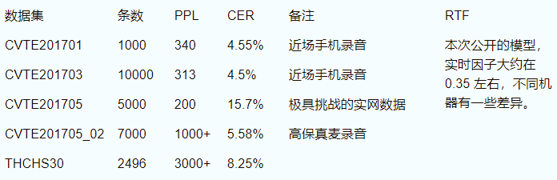

# Use TDNN model to train thchs30 set

## preparation

- [THCHS-30 : A Free Chinese Speech Corpus](https://arxiv.org/abs/1512.01882)
- [THCHS-30 download](http://www.openslr.org/18/)
- [CVTE 公司开源训练好的 TDNN 模型](http://kaldi-asr.org/models.html)
- [配置好 kaldi 环境](kaldi/readme.md)

## prediction

- 下载 CVTE-TDNN 模型

- 将模型解压到 `kaldi/egs` 目录下

        --> kaldi/egs/cvte

- 在 `kaldi/src/online2bin` 目录下执行

    > 利用 kaldi 中的 online2-wav-nnet3-latgen-faster 脚本,调用 thchs30 中相应的文件,识别出 thchs30 中的 wav 文件

    `./data/luanxiaoyang/speech_processing/kaldi/src/online2bin/online2-wav-nnet3-latgen-faster --do-endpointing=false --online=false --feature-type=fbank --fbank-config=/data/luanxiaoyang/speech_processing/database/CVTE\ Mandarin\ Model/cvte/s5/conf/fbank.conf --max-active=7000 --beam=15.0 --lattice-beam=6.0 --acoustic-scale=1.0 --word-symbol-table=/data/luanxiaoyang/speech_processing/database/CVTE\ Mandarin\ Model/cvte/s5/exp/chain/tdnn/graph/words.txt /data/luanxiaoyang/speech_processing/database/CVTE\ Mandarin\ Model/cvte/s5/exp/chain/tdnn/final.mdl /data/luanxiaoyang/speech_processing/database/CVTE\ Mandarin\ Model/cvte/s5/exp/chain/tdnn/graph/HCLG.fst 'ark:echo utter1 utter1|' 'scp:echo utter1 /data/luanxiaoyang/speech_processing/database/CVTE\ Mandarin\ Model/cvte/s5/data/wav/00030/2017_03_07_16.57.22_1175.wav|' ark:/dev/null`

    想测自己的语音文件，把`../../egs/cvte/s5/data/wav/00030 /`改成自己语音文件的路径。注意 WAV 文件要 16KHz, 16bit.

## 关于这个模型的描述

- ### 项目包括

        声学模型    exp/chain/tdnn/final.mdl
        解码图    exp/chain/tdnn/graph/HCLG.fst
        词表    exp/chain/tdnn/graph/word.txt
        全局    CMVN 参数  exp/chain/tdnn/global_cmvn
        帧采样因子    exp/chain/tdnn/frame_subsampling_factor，为 3
        特征配置文件    conf/，采用默认的 fbank，40 维特征
        测试数据    data/，10 条测试数据
        其它    steps, utils, local/score.sh 等 kaldi 对应的软链接

- ### 声学模型

    1. 数据集：远大于 2000 小时

    2. 训练流程

        1. Monophone 训练，mfcc+pitch 特征，句子 cmvn，600 小时，
        1. Triphone 训练，mfcc+pitch 特征，句子 cmvn，600 小时
        1. Lda-mllt 训练，mfcc+pitch 特征，句子 cmvn，600 小时
        1. Lda-mllt 训练，mfcc+pitch 特征，句子 cmvn，分多次增加数据集，重复此步训练过程
        1. TDNN 训练 + CE 准则，fbank 特征，online-cmvn，TDNN 结构 "-2,-1,0,1,2 -1,2 -2,1 -3,3 -5,1 0"，relu-dim=1024，（可采用 steps/nnet3/nnet3_to_dot.sh 查看 TDNN 结构）
        1. Chain model 训练，fbank 特征，online-cmvn，TDNN 结构不变

- ### 语言模型

    1. 数据集：1T 的新闻语料
    1. 训练工具：SRILM
    1. 模型类型：3-gram，大小 3.6G；一阶约 12 万，2 阶约 6500 万，3 阶给 7000 万

- ### 词典

    1. 数量：约 12 万

    1. 类似 THCHS30 公布的词典，严格来说，应该是声韵母词典

- ### 使用说明

    1. 解压文到 kaldi/egs 目录下，与常规的示例相同
    1. 确定 steps, utils, local/score.sh 链接有效
    1. 运行 run.sh 中 step1 部分（特征提取部分）
    1. 运行 run.sh 中 step2 部分（离线解码）
    1. 该模型支持在线解码，需要自己更改

        1. online-cmvn 特征处理（可参考 apply-cmvn-online，另外我在第二次 KALDI 的线下交流会 PPT 中有提到怎么在 KALDI 特征层面直接改为 online-cmvn 特征）
        1. 解码器中采用 AdvanceDecoding() 函数即可

- ### 一些测试结果

    

## Reference

    模型开源者：CVTE 中央研究院语音组
    联系人：雷延强
    邮箱：leiyanqiang@cvte.com

- [Time Delay Nerual Networks](https://github.com/luanxxys/computer_science/blob/master/machine_learning/TDNN/readme.md)
