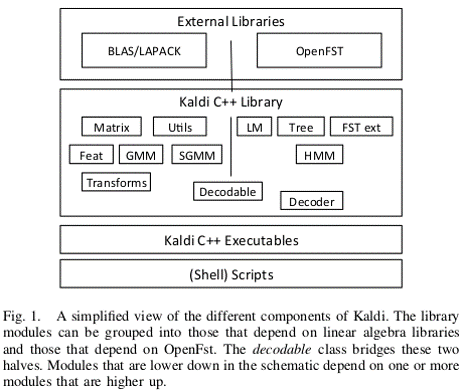

# Kaldi

kaldi 是一款基于 c++ 编写的完全开源的语音识别工具箱。

- ## [Installation](installation.md)

- ## Kaldi toolbox info

    + ### 特点及优势

        * 支持主流的特征提取：MFCC PLP 等
        * 支持传统的 GMM-HMM 的声学模型构建
        * 支持 WFST 的解码策略
        * 支持深度神经网络的声学建模
        * 完善的社区支持

    + ### 组织架构

        

        * 外部库
        * kaldi 自身的 C++ 库
        * C++ 可执行文件
        * Shell 脚本调用

    + ### 文件夹说明

        egs- 例子脚本,帮助你快速建立 ASR 系统,里面包含 30 个比较流行的语
        音库(文档附录在每一个工程里面)
        misc- 额外的工具和应用,对于一般的 kaldi 功能没有必要
        src- kaldi 的源代码
        tools- 有用的组成部分和外部工具,目录下主要是一些外部库
        windows- 在 windows 上运行 kaldi 的工具.

        很明显,最重要的部分是 egs。在这里你可以创建你自己的 ASR 系统。
